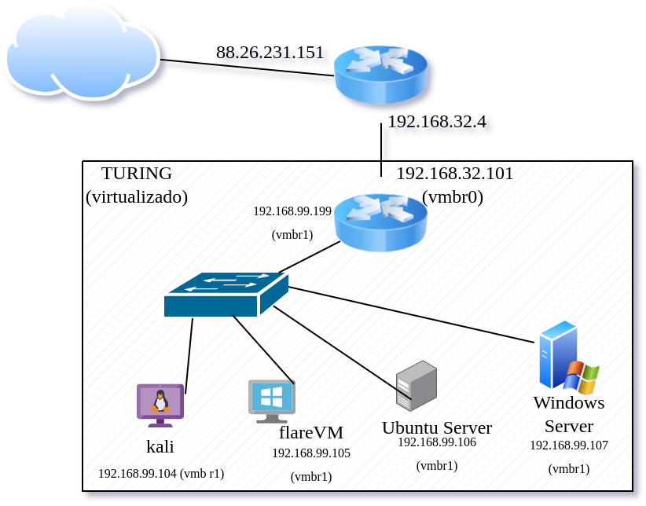
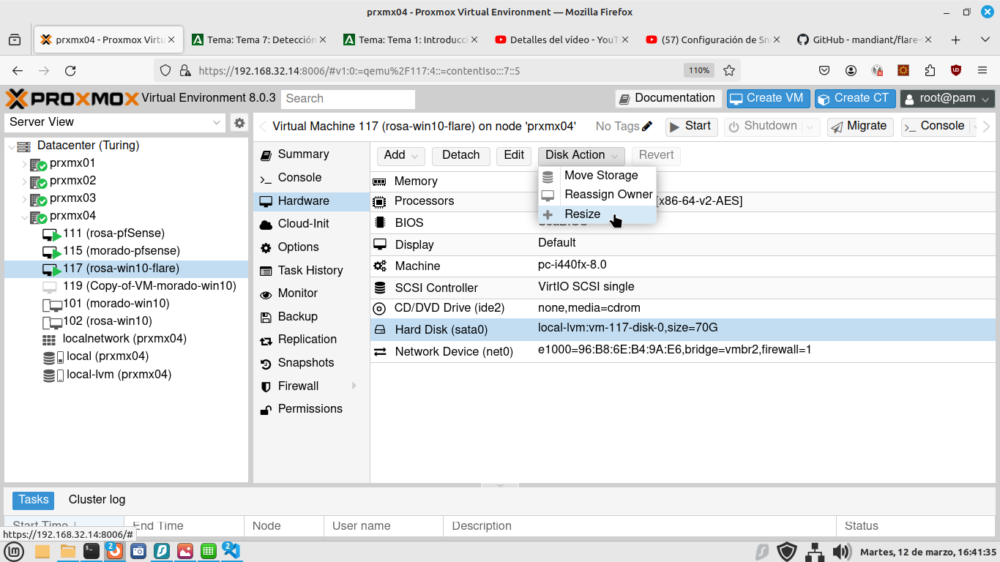
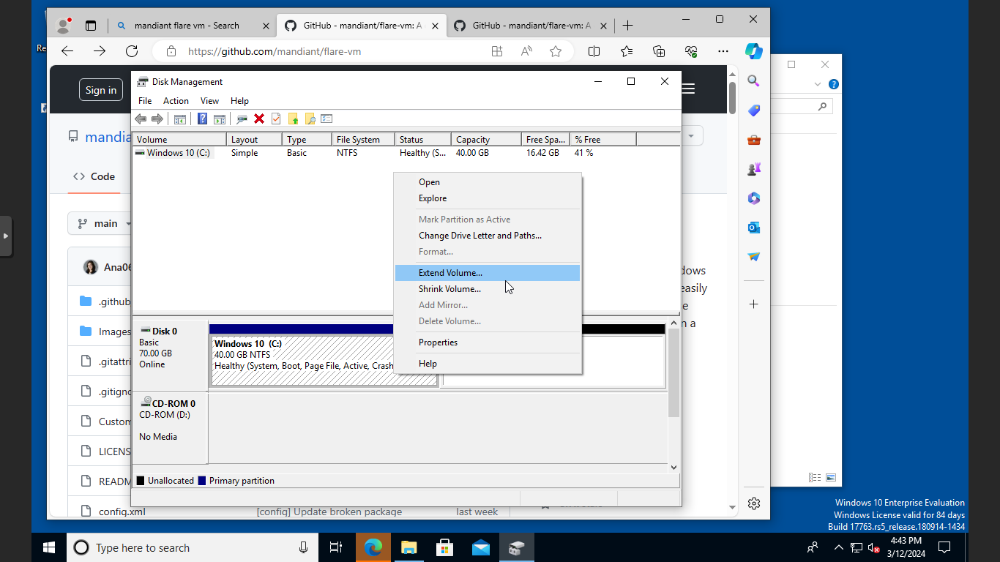

# Receta Homelab

Queremos instalar en un servidor Proxmox de virtualización un laboratorio de Purple Team.

Nuestro sistema debe tener:

* Un router / cortafuegos con:
  * pfBlocker (para limitar acceso por dominios y listas de IP)
  * Snort (como IPS)
  * OpenVPN para conectarnos al lab
* Un servidor Ubuntu con los siguientes servicios:
  * InfluxDB
  * Grafana
  * Kibana
  * Elastic
* Una máquina [Windows Flare](https://github.com/mandiant/flare-vm)
* Un servidor Windows Server 2012
* Un kali Linux Purple
* Un kali Linux Estándar





## Instalación de pfSense

Necesitamos una máquina virtual con dos tarjetas de red (o una tarjeta si disponemos de switch inteligentes con soporte VLAN).

1) Descarga de la ISO
   1) Desde su Web y luego se sube a Proxmox
   2) Descargar por URL desde Proxmox
   3) Como ya la tengo descargada la subo por `sftp` `/var/lib/vz/template/iso`. 
2) Creamos una VM con 4 GB de RAM, 20 GB de disco y 4 núcleos. Configuramos para que arranque con la ISO.
3) Ponemos una tarjeta de red que va al bridge donde está la interfaz física (vmbr0 por ejemplo)
4) Ponemos una segunda tarjeta de red a un swtich virtual (OVS Bridge)

## Configuración de pfSense

En modo terminal configuramos qué boca será la WAN, qué boca la LAN, la IP de cada uno, el servicio DHCP en la LAN y habilitamos la interfaz Web.

Vía Web, configuramos la contraseña de admin (por defecto **pfsense**), los DNS del sistema operativo, puerta de enlace, servicio de DNS, servidores DNS para el servicio DNS.

A continuación instalamos los paquetes:

* **snort**: Es el conocido IDS (sistema de detección de intrusiones) / IPS (sistema de prevención de instrusiones). Estamos hablando de IPS cuando activamos el bloqueo de IPs que ofenden reglas.
* **pfBlockerNG**: Bloqueador de contenido en base a dominios y direcciones IP. Cargamos listas negras desde Internet y así bloqueamos contenido como: pornografía, páginas de apuestas y juegos, de contenido ofensivo, etc.
* **darkstat** (puerto 666): Genera estadísticas por dirección IP, MAC, protocolos y puertos.
* **ntopng** (puerto 3000): Monitor de red (se puede ver flujos y hacer capturas en tiempo real.) 

### Configuración de Snort

oinkmaster code

### pfBlockerNG

Habilitamos listas de PR1, PRI4 y PRI5. Así como DNSBL.

### Darkstat

Ponerle una contraseña de acceso

### NtopNG

Ponerle una contraseña de acceso

## Cómo usar un OVA en Proxmox

Para usar un OVA en Proxmox, por SSH subimos el archivo OVA al servidor. Vamos a suponer que tenemos [un OVA de Windows 10 como este](https://archive.org/details/msedge.win10.virtualbox).

Desempaquetamos el OVA con tar: tar -xf archivo.ova. Buscamos el archivo VMDK, que será el disco de Windows 10. 

Creamos una máquina virtual para Windows 10. No le ponemos ni CDROM ni disco duro. Sólo 12 GB RAM, 6 cores y BIOS normal. Una vez creada buscamos el número o el ID de la máquina virtual y con él, desde línea de comandos en Proxmox hacemos:

```bash
qm disk import 101  'MSEdge - Win10-disk001.vmdk' local-lvm --format qcow2
```

Esto importa el disco `MSEdge - Win10-disk001.vmdk` en la máquina 101, lo guarda en el espacio de almacenamiento local-lvm (en esa partición). Una vez acaba el proceso el disco aparece en la máquina pero sin conectar. Hacemos doble clic y lo añadimos como SATA 0.

La máquina viene con 40 GB, es poco, necesitamos darle otros 30 GB. Pulsamos en hardware -> disk action -> resize.



En Windows, nos vamos al administrador de discos y extendemos la partición hasta el final del disco:


