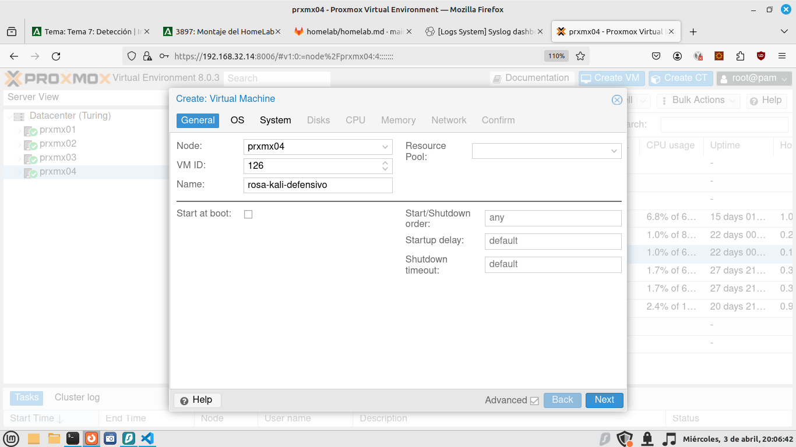
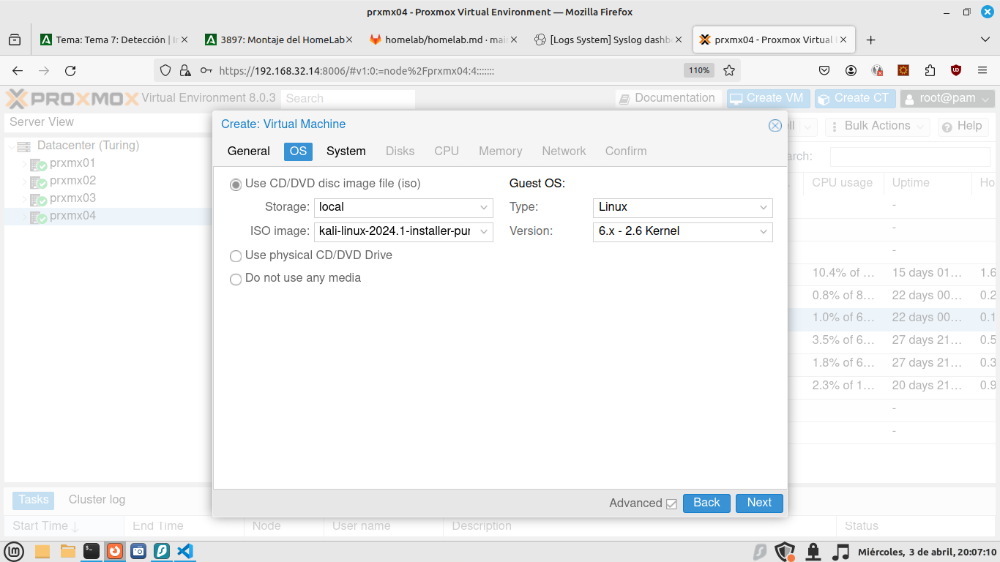
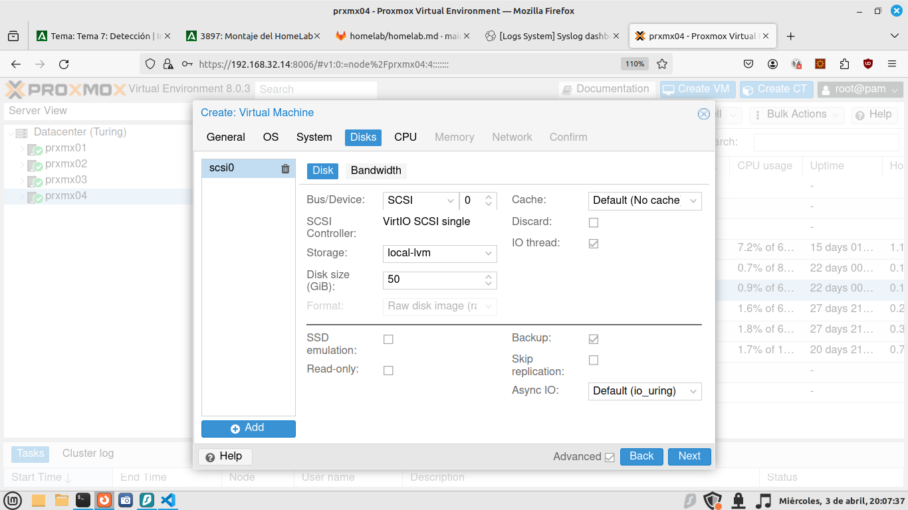
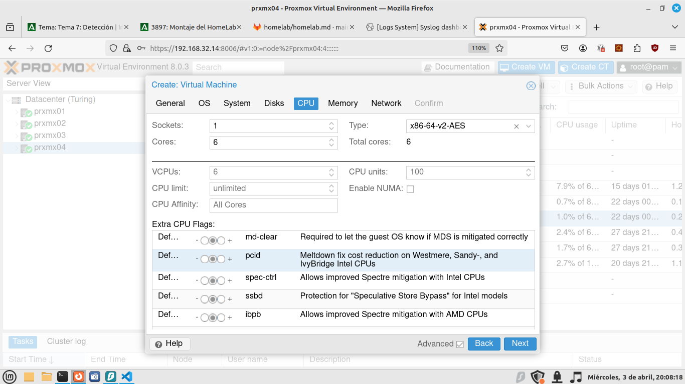
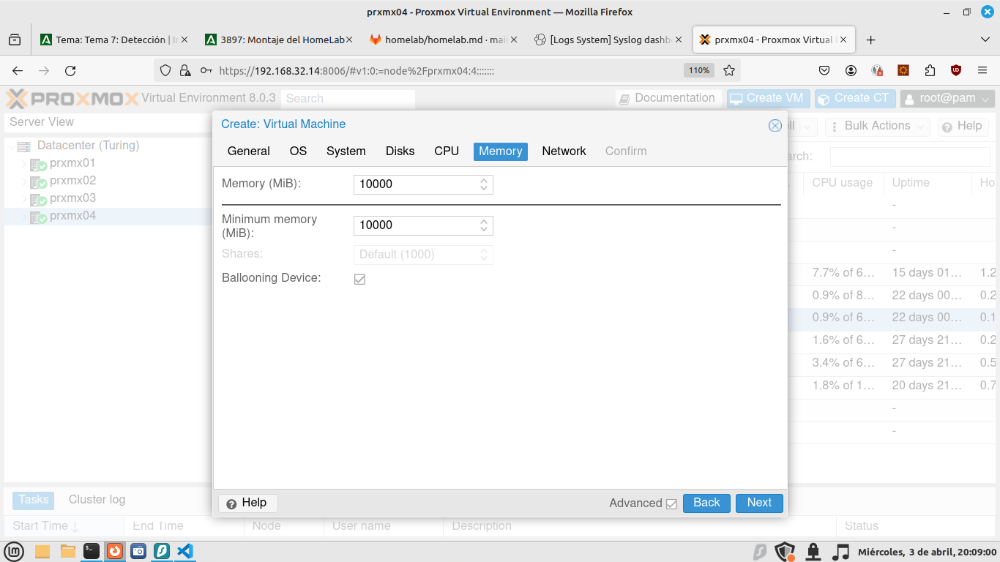
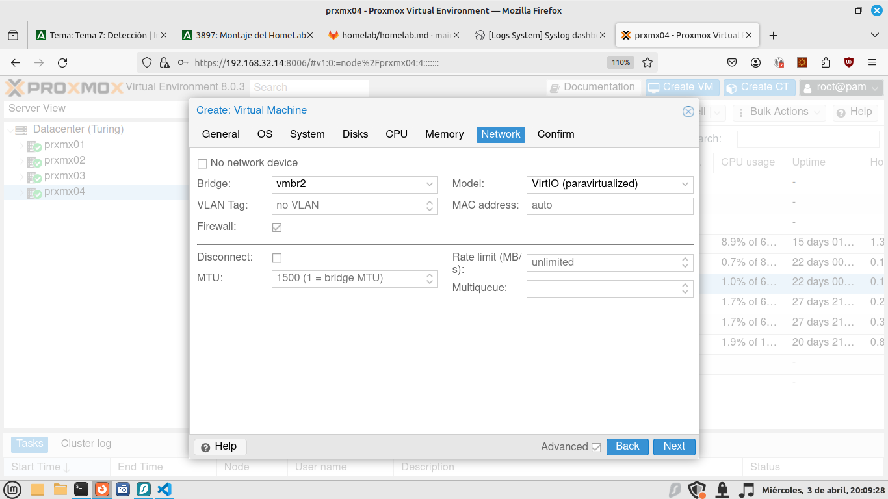

# Receta Homelab

Queremos instalar en un servidor Proxmox de virtualización un laboratorio de Purple Team.

Nuestro sistema debe tener:

* Un router / cortafuegos con:
  * pfBlocker (para limitar acceso por dominios y listas de IP)
  * Snort (como IPS)
  * OpenVPN para conectarnos al lab
* Un servidor Ubuntu con los siguientes servicios:
  * InfluxDB
  * Grafana
  * Kibana
  * Elastic
* Una máquina [Windows Flare](https://github.com/mandiant/flare-vm)
* Un servidor Windows Server 2012
* Un kali Linux Purple
* Un kali Linux Estándar


## Instalación de pfSense

Necesitamos una máquina virtual con dos tarjetas de red (o una tarjeta si disponemos de switch inteligentes con soporte VLAN).

1) Descarga de la ISO
   1) Desde su Web y luego se sube a Proxmox
   2) Descargar por URL desde Proxmox
   3) Como ya la tengo descargada la subo por `sftp` `/var/lib/vz/template/iso`. 
2) Creamos una VM con 4 GB de RAM, 20 GB de disco y 4 núcleos. Configuramos para que arranque con la ISO.
3) Ponemos una tarjeta de red que va al bridge donde está la interfaz física (vmbr0 por ejemplo)
4) Ponemos una segunda tarjeta de red a un swtich virtual (OVS Bridge)

## Configuración de pfSense

En modo terminal configuramos qué boca será la WAN, qué boca la LAN, la IP de cada uno, el servicio DHCP en la LAN y habilitamos la interfaz Web.

Vía Web, configuramos la contraseña de admin (por defecto **pfsense**), los DNS del sistema operativo, puerta de enlace, servicio de DNS, servidores DNS para el servicio DNS.

A continuación instalamos los paquetes:

* **snort**: Es el conocido IDS (sistema de detección de intrusiones) / IPS (sistema de prevención de instrusiones). Estamos hablando de IPS cuando activamos el bloqueo de IPs que ofenden reglas.
* **pfBlockerNG**: Bloqueador de contenido en base a dominios y direcciones IP. Cargamos listas negras desde Internet y así bloqueamos contenido como: pornografía, páginas de apuestas y juegos, de contenido ofensivo, etc.
* **darkstat** (puerto 666): Genera estadísticas por dirección IP, MAC, protocolos y puertos.
* **ntopng** (puerto 3000): Monitor de red (se puede ver flujos y hacer capturas en tiempo real.) 

### Configuración de Snort

oinkmaster code

### pfBlockerNG

Habilitamos listas de PR1, PRI4 y PRI5. Así como DNSBL.

### Darkstat

Ponerle una contraseña de acceso

### NtopNG

Ponerle una contraseña de acceso

### Configuración de Telegraf

Ejemplo de configuración del apartado de elastic para que mande los datos a un servidor Elasticsearch:

```yaml
[[outputs.elasticsearch]]
	enable_sniffer = false
	health_check_interval = "10s"
	index_name = "telegraf-%Y.%m.%d"
	manage_template = false
	overwrite_template = true
	template_name = "telegraf"
	urls = ["https://192.168.99.10:9200?sniff=false"]
	# timeout = "5s"
	username = "elastic"
	password = "vQjBpLb53ehgBgcoICW+"
	# health_check_timeout = "1s"	
	# auth_bearer_token = "Vzlld3FJNEIyWFMyUG80US12RGc6aGVPQ2ZqR01Rc1M1cjJiTkZNOEdQQQ=="
	# force_document_id = false
	default_pipeline = "logs-pfsense.log-1.19.0"

```

## Cómo usar un OVA en Proxmox

Para usar un OVA en Proxmox, por SSH subimos el archivo OVA al servidor. Vamos a suponer que tenemos [un OVA de Windows 10 como este](https://archive.org/details/msedge.win10.virtualbox).

Desempaquetamos el OVA con tar: tar -xf archivo.ova. Buscamos el archivo VMDK, que será el disco de Windows 10. 

Creamos una máquina virtual para Windows 10. No le ponemos ni CDROM ni disco duro. Sólo 12 GB RAM, 6 cores y BIOS normal. Una vez creada buscamos el número o el ID de la máquina virtual y con él, desde línea de comandos en Proxmox hacemos:

```bash
qm disk import 101  'MSEdge - Win10-disk001.vmdk' local-lvm --format qcow2
```

Esto importa el disco `MSEdge - Win10-disk001.vmdk` en la máquina 101, lo guarda en el espacio de almacenamiento local-lvm (en esa partición). Una vez acaba el proceso el disco aparece en la máquina pero sin conectar. Hacemos doble clic y lo añadimos como SATA 0.

La máquina viene con 40 GB, es poco, necesitamos darle otros 30 GB. Pulsamos en hardware -> disk action -> resize.


En Windows, nos vamos al administrador de discos y extendemos la partición hasta el final del disco:


## Instalación de Ubuntu Server + ELK

Partimos que tenemos instalado Ubuntu Server 22.04.

Nos aseguramos de tener IP estática, fichero /etc/netplan/00-installer-config.yaml

```yaml
# This is the network config written by 'subiquity'
network:
  ethernets:
    ens18:
      addresses:
      - 192.168.99.10/24
      nameservers:
        addresses:
        - 192.168.99.199
        search:
        - homelab.lan
      routes:
      - to: default
        via: 192.168.99.199
  version: 2
``` 

Ahora aplicamos los cambios: 

> root@ubsrv00:/etc/netplan# netplan apply


Instalamos la pila ELK:

```bash
#!/bin/bash

wget -qO - https://artifacts.elastic.co/GPG-KEY-elasticsearch | sudo gpg --dearmor -o /usr/share/keyrings/elasticsearch-keyring.gpg

sudo apt-get install apt-transport-https

echo "deb [signed-by=/usr/share/keyrings/elasticsearch-keyring.gpg] https://artifacts.elastic.co/packages/8.x/apt stable main" | sudo tee /etc/apt/sources.list.d/elastic-8.x.list


sudo apt-get update
sudo apt-get install elasticsearch 
sudo apt-get install kibana
sudo apt-get install logstash

sudo /bin/systemctl daemon-reload
sudo /bin/systemctl enable elasticsearch.service
sudo /bin/systemctl enable kibana.service

sudo systemctl start elasticsearch.service
sudo systemctl start kibana.service
```


Ahora ya podemos ver elastic en el puerto 9200 y kibana en el 5601. 

El usuario será **elastic** y la contraseña la que se generó.

**Para resetear la contraseña del superusuario elastic hacemos:**

```bash
sudo /usr/share/elasticsearch/bin/elasticsearch-reset-password -a -u elastic
```

Cuando ejecutamos el comando debe salir algo así:

```
root@ubsrv00:/home/usuario# /usr/share/elasticsearch/bin/elasticsearch-reset-password -a -u elastic
This tool will reset the password of the [elastic] user to an autogenerated value.
The password will be printed in the console.
Please confirm that you would like to continue [y/N]y


Password for the [elastic] user successfully reset.
New value: vQjBpLb53ehgBgcoICW+
```

Para conectar vía túnel SSH:

```bash
ssh -L 5601:localhost:5601  usuario@192.168.99.10
```

Ahora abrimos en un navegador la URL <http://localhost:5601>.

Para **generar un token para hacer el enrolment de kibana a elastic**:

```bash
sudo /usr/share/elasticsearch/bin/elasticsearch-create-enrollment-token -s kibana
```

Para obtener el código por el que me pregunta kibana:

```bash
sudo /usr/share/kibana/bin/kibana-verification-code
```

Ahora ya podemos hacer login con el usuario **elastic** y la contraseña que generamos anteriormente.

Una vez dentro de Kibana, vamos a añadir una primera integración, por ejemplo Sysmon para Linux. Buscamos "add integrations"

```bash
curl -L -O https://artifacts.elastic.co/downloads/beats/elastic-agent/elastic-agent-8.13.1-linux-x86_64.tar.gz
tar xzvf elastic-agent-8.13.1-linux-x86_64.tar.gz
cd elastic-agent-8.13.1-linux-x86_64
```

En la carpeta **/opt/Elastic/Agent** encontramos el archivo: **elastic-agent.yml**. Lo editamos y copiamos el contenido que nos dice Kibana en él:

```yaml
id: 5819286e-ca12-4be3-9a6c-76f4d77071f5
revision: 2
outputs:
  default:
    type: elasticsearch
    hosts:
      - 'https://192.168.99.10:9200'
    ssl.ca_trusted_fingerprint: 4f92177235ffd24d4c7441649ace50b6e51f973781a73c9799f335b3d00f8bff
    username: 'elastic'
    password: 'vQjBpLb53ehgBgcoICW+'
    preset: balanced
output_permissions:
  default:
    _elastic_agent_monitoring:
      indices:
        - names:
            - logs-elastic_agent.apm_server-default
          privileges:
            - auto_configure
            - create_doc
        - names:
            - metrics-elastic_agent.apm_server-default
          privileges:
            - auto_configure
            - create_doc
        - names:
            - logs-elastic_agent.auditbeat-default
          privileges:
            - auto_configure
            - create_doc
        - names:
            - metrics-elastic_agent.auditbeat-default
          privileges:
            - auto_configure
            - create_doc
        - names:
            - logs-elastic_agent.cloud_defend-default
          privileges:
            - auto_configure
            - create_doc
        - names:
            - logs-elastic_agent.cloudbeat-default
          privileges:
            - auto_configure
            - create_doc
        - names:
            - metrics-elastic_agent.cloudbeat-default
          privileges:
            - auto_configure
            - create_doc
        - names:
            - logs-elastic_agent-default
          privileges:
            - auto_configure
            - create_doc
        - names:
            - metrics-elastic_agent.elastic_agent-default
          privileges:
            - auto_configure
            - create_doc
        - names:
            - metrics-elastic_agent.endpoint_security-default
          privileges:
            - auto_configure
            - create_doc
        - names:
            - logs-elastic_agent.endpoint_security-default
          privileges:
            - auto_configure
            - create_doc
        - names:
            - logs-elastic_agent.filebeat_input-default
          privileges:
            - auto_configure
            - create_doc
        - names:
            - metrics-elastic_agent.filebeat_input-default
          privileges:
            - auto_configure
            - create_doc
        - names:
            - logs-elastic_agent.filebeat-default
          privileges:
            - auto_configure
            - create_doc
        - names:
            - metrics-elastic_agent.filebeat-default
          privileges:
            - auto_configure
            - create_doc
        - names:
            - logs-elastic_agent.fleet_server-default
          privileges:
            - auto_configure
            - create_doc
        - names:
            - metrics-elastic_agent.fleet_server-default
          privileges:
            - auto_configure
            - create_doc
        - names:
            - logs-elastic_agent.heartbeat-default
          privileges:
            - auto_configure
            - create_doc
        - names:
            - metrics-elastic_agent.heartbeat-default
          privileges:
            - auto_configure
            - create_doc
        - names:
            - logs-elastic_agent.metricbeat-default
          privileges:
            - auto_configure
            - create_doc
        - names:
            - metrics-elastic_agent.metricbeat-default
          privileges:
            - auto_configure
            - create_doc
        - names:
            - logs-elastic_agent.osquerybeat-default
          privileges:
            - auto_configure
            - create_doc
        - names:
            - metrics-elastic_agent.osquerybeat-default
          privileges:
            - auto_configure
            - create_doc
        - names:
            - logs-elastic_agent.packetbeat-default
          privileges:
            - auto_configure
            - create_doc
        - names:
            - metrics-elastic_agent.packetbeat-default
          privileges:
            - auto_configure
            - create_doc
        - names:
            - logs-elastic_agent.pf_elastic_collector-default
          privileges:
            - auto_configure
            - create_doc
        - names:
            - logs-elastic_agent.pf_elastic_symbolizer-default
          privileges:
            - auto_configure
            - create_doc
        - names:
            - logs-elastic_agent.pf_host_agent-default
          privileges:
            - auto_configure
            - create_doc
    _elastic_agent_checks:
      cluster:
        - monitor
    1bec8846-a7c2-4eeb-a750-01043a78ace8:
      indices:
        - names:
            - logs-system.auth-default
          privileges:
            - auto_configure
            - create_doc
        - names:
            - logs-system.syslog-default
          privileges:
            - auto_configure
            - create_doc
        - names:
            - logs-system.application-default
          privileges:
            - auto_configure
            - create_doc
        - names:
            - logs-system.security-default
          privileges:
            - auto_configure
            - create_doc
        - names:
            - logs-system.system-default
          privileges:
            - auto_configure
            - create_doc
        - names:
            - metrics-system.cpu-default
          privileges:
            - auto_configure
            - create_doc
        - names:
            - metrics-system.diskio-default
          privileges:
            - auto_configure
            - create_doc
        - names:
            - metrics-system.filesystem-default
          privileges:
            - auto_configure
            - create_doc
        - names:
            - metrics-system.fsstat-default
          privileges:
            - auto_configure
            - create_doc
        - names:
            - metrics-system.load-default
          privileges:
            - auto_configure
            - create_doc
        - names:
            - metrics-system.memory-default
          privileges:
            - auto_configure
            - create_doc
        - names:
            - metrics-system.network-default
          privileges:
            - auto_configure
            - create_doc
        - names:
            - metrics-system.process-default
          privileges:
            - auto_configure
            - create_doc
        - names:
            - metrics-system.process.summary-default
          privileges:
            - auto_configure
            - create_doc
        - names:
            - metrics-system.socket_summary-default
          privileges:
            - auto_configure
            - create_doc
        - names:
            - metrics-system.uptime-default
          privileges:
            - auto_configure
            - create_doc
    2caf5c0e-d2b8-4774-a2c5-dd53759f37a9:
      indices:
        - names:
            - logs-sysmon_linux.log-default
          privileges:
            - auto_configure
            - create_doc
agent:
  download:
    sourceURI: 'https://artifacts.elastic.co/downloads/'
  monitoring:
    enabled: true
    use_output: default
    namespace: default
    logs: true
    metrics: true
  features: {}
  protection:
    enabled: false
    uninstall_token_hash: DtqlBG/RdXDbZvzRHK7PpI1pL26C+lE3IekPOIHGAog=
    signing_key: >-
      MFkwEwYHKoZIzj0CAQYIKoZIzj0DAQcDQgAELiZJClbfhFpkJBEiTowIEsV3Hy87uM40mrLBQVxnpbbwwP8KGVw2tU2kWK7bOGVtuHRUXIZEuLgJTg4F9UnVqA==
inputs:
  - id: logfile-system-1bec8846-a7c2-4eeb-a750-01043a78ace8
    name: system-1
    revision: 1
    type: logfile
    use_output: default
    meta:
      package:
        name: system
        version: 1.54.0
    data_stream:
      namespace: default
    package_policy_id: 1bec8846-a7c2-4eeb-a750-01043a78ace8
    streams:
      - id: logfile-system.auth-1bec8846-a7c2-4eeb-a750-01043a78ace8
        data_stream:
          dataset: system.auth
          type: logs
        ignore_older: 72h
        paths:
          - /var/log/auth.log*
          - /var/log/secure*
        exclude_files:
          - \.gz$
        multiline:
          pattern: ^\s
          match: after
        tags:
          - system-auth
        processors:
          - add_locale: null
          - rename:
              fields:
                - from: message
                  to: event.original
              ignore_missing: true
              fail_on_error: false
          - syslog:
              field: event.original
              ignore_missing: true
              ignore_failure: true
      - id: logfile-system.syslog-1bec8846-a7c2-4eeb-a750-01043a78ace8
        data_stream:
          dataset: system.syslog
          type: logs
        paths:
          - /var/log/messages*
          - /var/log/syslog*
          - /var/log/system*
        exclude_files:
          - \.gz$
        multiline:
          pattern: ^\s
          match: after
        processors:
          - add_locale: null
        tags: null
        ignore_older: 72h
  - id: winlog-system-1bec8846-a7c2-4eeb-a750-01043a78ace8
    name: system-1
    revision: 1
    type: winlog
    use_output: default
    meta:
      package:
        name: system
        version: 1.54.0
    data_stream:
      namespace: default
    package_policy_id: 1bec8846-a7c2-4eeb-a750-01043a78ace8
    streams:
      - id: winlog-system.application-1bec8846-a7c2-4eeb-a750-01043a78ace8
        name: Application
        data_stream:
          dataset: system.application
          type: logs
        condition: '${host.platform} == ''windows'''
        ignore_older: 72h
      - id: winlog-system.security-1bec8846-a7c2-4eeb-a750-01043a78ace8
        name: Security
        data_stream:
          dataset: system.security
          type: logs
        condition: '${host.platform} == ''windows'''
        ignore_older: 72h
      - id: winlog-system.system-1bec8846-a7c2-4eeb-a750-01043a78ace8
        name: System
        data_stream:
          dataset: system.system
          type: logs
        condition: '${host.platform} == ''windows'''
        ignore_older: 72h
  - id: system/metrics-system-1bec8846-a7c2-4eeb-a750-01043a78ace8
    name: system-1
    revision: 1
    type: system/metrics
    use_output: default
    meta:
      package:
        name: system
        version: 1.54.0
    data_stream:
      namespace: default
    package_policy_id: 1bec8846-a7c2-4eeb-a750-01043a78ace8
    streams:
      - id: system/metrics-system.cpu-1bec8846-a7c2-4eeb-a750-01043a78ace8
        data_stream:
          dataset: system.cpu
          type: metrics
        metricsets:
          - cpu
        cpu.metrics:
          - percentages
          - normalized_percentages
        period: 10s
      - id: system/metrics-system.diskio-1bec8846-a7c2-4eeb-a750-01043a78ace8
        data_stream:
          dataset: system.diskio
          type: metrics
        metricsets:
          - diskio
        diskio.include_devices: null
        period: 10s
      - id: system/metrics-system.filesystem-1bec8846-a7c2-4eeb-a750-01043a78ace8
        data_stream:
          dataset: system.filesystem
          type: metrics
        metricsets:
          - filesystem
        period: 1m
        processors:
          - drop_event.when.regexp:
              system.filesystem.mount_point: ^/(sys|cgroup|proc|dev|etc|host|lib|snap)($|/)
      - id: system/metrics-system.fsstat-1bec8846-a7c2-4eeb-a750-01043a78ace8
        data_stream:
          dataset: system.fsstat
          type: metrics
        metricsets:
          - fsstat
        period: 1m
        processors:
          - drop_event.when.regexp:
              system.fsstat.mount_point: ^/(sys|cgroup|proc|dev|etc|host|lib|snap)($|/)
      - id: system/metrics-system.load-1bec8846-a7c2-4eeb-a750-01043a78ace8
        data_stream:
          dataset: system.load
          type: metrics
        metricsets:
          - load
        condition: '${host.platform} != ''windows'''
        period: 10s
      - id: system/metrics-system.memory-1bec8846-a7c2-4eeb-a750-01043a78ace8
        data_stream:
          dataset: system.memory
          type: metrics
        metricsets:
          - memory
        period: 10s
      - id: system/metrics-system.network-1bec8846-a7c2-4eeb-a750-01043a78ace8
        data_stream:
          dataset: system.network
          type: metrics
        metricsets:
          - network
        period: 10s
        network.interfaces: null
      - id: system/metrics-system.process-1bec8846-a7c2-4eeb-a750-01043a78ace8
        data_stream:
          dataset: system.process
          type: metrics
        metricsets:
          - process
        period: 10s
        process.include_top_n.by_cpu: 5
        process.include_top_n.by_memory: 5
        process.cmdline.cache.enabled: true
        process.cgroups.enabled: false
        process.include_cpu_ticks: false
        processes:
          - .*
      - id: >-
          system/metrics-system.process.summary-1bec8846-a7c2-4eeb-a750-01043a78ace8
        data_stream:
          dataset: system.process.summary
          type: metrics
        metricsets:
          - process_summary
        period: 10s
      - id: >-
          system/metrics-system.socket_summary-1bec8846-a7c2-4eeb-a750-01043a78ace8
        data_stream:
          dataset: system.socket_summary
          type: metrics
        metricsets:
          - socket_summary
        period: 10s
      - id: system/metrics-system.uptime-1bec8846-a7c2-4eeb-a750-01043a78ace8
        data_stream:
          dataset: system.uptime
          type: metrics
        metricsets:
          - uptime
        period: 10s
  - id: filestream-sysmon_linux-2caf5c0e-d2b8-4774-a2c5-dd53759f37a9
    name: sysmon_linux-1
    revision: 1
    type: filestream
    use_output: default
    meta:
      package:
        name: sysmon_linux
        version: 1.6.2
    data_stream:
      namespace: default
    package_policy_id: 2caf5c0e-d2b8-4774-a2c5-dd53759f37a9
    streams:
      - id: filestream-sysmon_linux.log-2caf5c0e-d2b8-4774-a2c5-dd53759f37a9
        data_stream:
          dataset: sysmon_linux.log
          type: logs
        paths:
          - /var/log/sysmon*
        prospector.scanner.exclude_files:
          - \.gz$
        tags: null
        processors:
          - add_locale: null
          - rename:
              fields:
                - from: message
                  to: event.original
              ignore_missing: true
              fail_on_error: false
          - syslog:
              field: event.original
              ignore_missing: true
              ignore_failure: true
          - drop_event:
              when:
                and:
                  - has_fields:
                      - log.syslog.appname
                  - not:
                      equals:
                        log.syslog.appname: sysmon
          - decode_xml_wineventlog:
              when:
                regexp:
                  message: ^\<Event
              field: event.original
              target_field: winlog
              ignore_missing: true
              ignore_failure: true
              map_ecs_fields: true
        ignore_older: 72h
signed:
  data: >-
    eyJpZCI6IjU4MTkyODZlLWNhMTItNGJlMy05YTZjLTc2ZjRkNzcwNzFmNSIsImFnZW50Ijp7ImZlYXR1cmVzIjp7fSwicHJvdGVjdGlvbiI6eyJlbmFibGVkIjpmYWxzZSwidW5pbnN0YWxsX3Rva2VuX2hhc2giOiJEdHFsQkcvUmRYRGJadnpSSEs3UHBJMXBMMjZDK2xFM0lla1BPSUhHQW9nPSIsInNpZ25pbmdfa2V5IjoiTUZrd0V3WUhLb1pJemowQ0FRWUlLb1pJemowREFRY0RRZ0FFTGlaSkNsYmZoRnBrSkJFaVRvd0lFc1YzSHk4N3VNNDBtckxCUVZ4bnBiYnd3UDhLR1Z3MnRVMmtXSzdiT0dWdHVIUlVYSVpFdUxnSlRnNEY5VW5WcUE9PSJ9fSwiaW5wdXRzIjpbeyJpZCI6ImxvZ2ZpbGUtc3lzdGVtLTFiZWM4ODQ2LWE3YzItNGVlYi1hNzUwLTAxMDQzYTc4YWNlOCIsIm5hbWUiOiJzeXN0ZW0tMSIsInJldmlzaW9uIjoxLCJ0eXBlIjoibG9nZmlsZSJ9LHsiaWQiOiJ3aW5sb2ctc3lzdGVtLTFiZWM4ODQ2LWE3YzItNGVlYi1hNzUwLTAxMDQzYTc4YWNlOCIsIm5hbWUiOiJzeXN0ZW0tMSIsInJldmlzaW9uIjoxLCJ0eXBlIjoid2lubG9nIn0seyJpZCI6InN5c3RlbS9tZXRyaWNzLXN5c3RlbS0xYmVjODg0Ni1hN2MyLTRlZWItYTc1MC0wMTA0M2E3OGFjZTgiLCJuYW1lIjoic3lzdGVtLTEiLCJyZXZpc2lvbiI6MSwidHlwZSI6InN5c3RlbS9tZXRyaWNzIn0seyJpZCI6ImZpbGVzdHJlYW0tc3lzbW9uX2xpbnV4LTJjYWY1YzBlLWQyYjgtNDc3NC1hMmM1LWRkNTM3NTlmMzdhOSIsIm5hbWUiOiJzeXNtb25fbGludXgtMSIsInJldmlzaW9uIjoxLCJ0eXBlIjoiZmlsZXN0cmVhbSJ9XX0=
  signature: >-
    MEUCIQCqoZobVsHFlO7tCu/5PTD1iB0L7JwxhJVibAwqqYI0eAIgRazNx+s7OWHwxfxez8MTAS+1sJ/MG5ABCxwuf9JYOfA=
secret_references: []

```

## Instalación de Kali Purple 2024.01

Creamos la máquina (color_equipo-kali-defensivo):



Le indico donde está la ISO (previamente descargada) de Kali Purple:



Fijamos 50 GB de disco: 



Seleccionamos los cores:



Ahora fijamos la memoria RAM reservada para la máquina (nuestro servidor tiene 256 GB):



Conectamos a la red interna del HomeLab (vmbr1, vmbr2, etc., según lo tengamos):



Arrancamos e instalamos con los siguientes parámetros:

1. Configuración idioma y local: España  (Spain / Español / España)
2. Nombre del host: kali01
3. Usuario: kali
4. Password: el de siempre
5. Particionado: Guiado usar todo el disco (NO LVM)
6. Todos los archivos en una partición (no necesitamos aún tener el *home* aparte)
7. Continuamos con la instalación hasta que pide reiniciar
   


